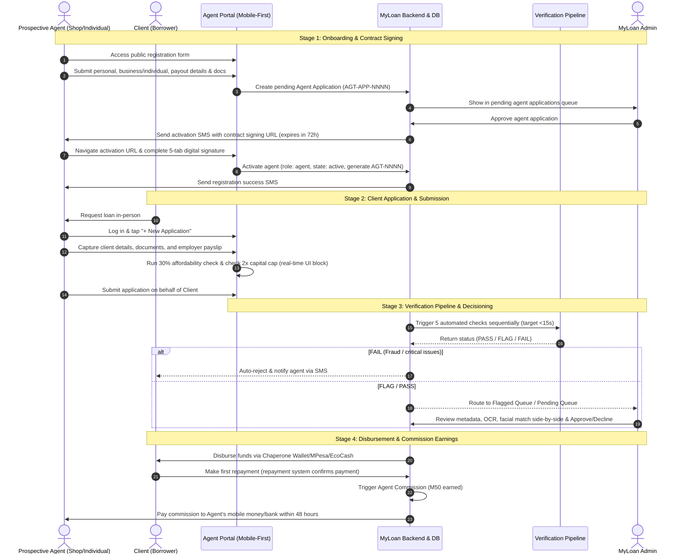
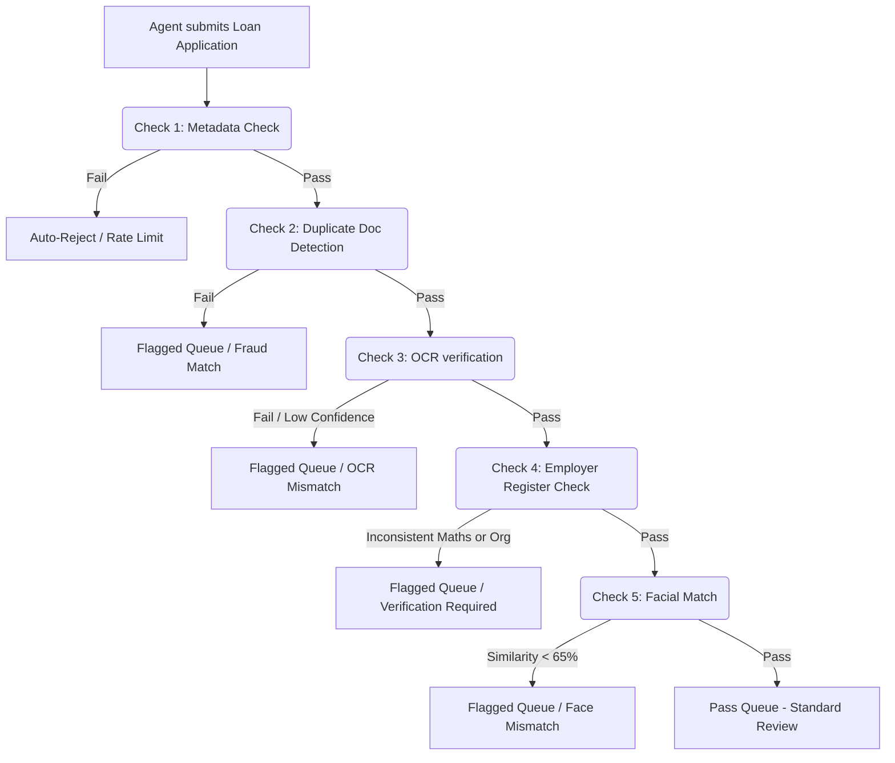

# MYLOAN COMMUNITY AGENT PORTAL — IMPLEMENTATION PLAN
**Confidential Developer Specification & Transition Blueprint**  
**Version:** 1.0 — May 2026  
**Status:** Ready for Review  

---

## 1. System Architecture & High-Level Flow

This document details the transition from the legacy **Loan Officer Module** to the new, mobile-first **Community Agent Module**. Agents will be local shop owners (spaza shops, general dealers, tuck shops, mobile money agents) or individual community connectors/freelance agents. 

### The End-to-End Agent Lifecycle & Loan Flow



---

## 2. Database Schema & Migration Strategy

To support the removal of the **Loan Officer Module** and ensure seamless integration of the **Agent Module** (supporting both shops and individuals), we will add the following migrations.

### Table: `agent_applications`
Used to capture registration submissions from prospective agents (no user account is created yet).

```php
Schema::create('agent_applications', function (Blueprint $table) {
    $table->id();
    $table->string('application_ref')->unique(); // AGT-APP-NNNN
    $table->string('first_name');
    $table->string('last_name');
    $table->string('national_id')->unique();
    $table->string('mobile_number');
    $table->string('agent_type'); // 'shop' or 'individual'
    
    // Shop details (nullable if individual)
    $table->string('shop_name')->nullable();
    $table->string('shop_location')->nullable(); // village/town
    $table->string('business_type')->nullable(); // Spaza, Tuck shop, Mobile money, Pharmacy, Other

    // Uploaded docs paths
    $table->string('national_id_path');
    $table->string('selfie_holding_id_path');
    $table->string('business_licence_path')->nullable(); // Optional

    // Payout details
    $table->string('payout_method'); // 'M-Pesa', 'EcoCash', 'Bank'
    $table->string('payout_number_or_details');
    $table->string('payout_account_name');
    $table->string('payout_bank_name')->nullable(); // bank-specific

    // Vetting details
    $table->string('status')->default('pending'); // pending, approved, rejected, documents_requested
    $table->text('admin_feedback')->nullable();
    
    $table->timestamps();
    $table->softDeletes();
});
```

### Table: `agent_profiles`
Maintains operational, business, and financial parameters for active, approved agents. Linked directly to the `users` table.

```php
Schema::create('agent_profiles', function (Blueprint $table) {
    $table->id();
    $table->foreignId('user_id')->constrained('users')->onDelete('cascade');
    $table->string('agent_id')->unique(); // AGT-NNNN
    $table->string('agent_type'); // 'shop' or 'individual'
    
    // Business/Individual Profile
    $table->string('shop_name')->nullable();
    $table->string('shop_location')->nullable();
    $table->string('business_type')->nullable();
    
    // Payout Details
    $table->string('payout_method');
    $table->string('payout_number_or_details');
    $table->string('payout_account_name');
    $table->string('payout_bank_name')->nullable();

    // Commission Metrics
    $table->decimal('total_earned', 10, 2)->default(0.00);
    $table->decimal('pending_earnings', 10, 2)->default(0.00);

    // Agreement signing trail
    $table->string('contract_ref')->nullable(); // AGT-AGR-NNNN
    $table->timestamp('signed_at')->nullable();
    $table->text('signature_base64_path')->nullable();
    $table->string('signed_ip')->nullable();

    $table->timestamps();
});
```

### Table Modifications: `users` & `loan_applications`
1. **`users` table**: Ensure role supports `'agent'` (replacing or running alongside `'loan_officer'` temporarily during migration).
2. **`loan_applications` table**:
   - Add `agent_id` (nullable foreign key) to track which agent captured the borrower's loan application.
   - Add `verification_status` ('pass', 'flagged', 'fail') and `verification_meta` (JSON field to store scores/results from the 5 pipeline checks).
3. **`referrals` / `commission_logs` table**:
   - Create a dedicated log to track when commissions are generated, paid, or set as pending.

---

## 3. Screen Flows & Detailed UX Specs

### Screen 1: Agent Registration Form (Public - No Auth)
A premium, mobile-optimized, glassmorphic multi-step form built for smooth 1-handed smartphone interaction.

*   **Step 1: Profile Type Selection & Info**
    *   **Agent Type Selector:** Large interactive card selector: `[ Shop Owner ]` or `[ Individual Consultant ]`.
    *   *Conditional Fields:* If "Shop Owner" selected, dynamically expand: Shop Name, Location/Village, Business Type dropdown. If "Individual", show "Service Location/Village".
    *   Collect: First Name, Last Name, National ID (13 numeric digits), Lesotho Mobile Number (`+266 5X XXX XXXX`).
*   **Step 2: Biometric & Document Upload**
    *   Required: Front & Back ID Photo, and a high-res Selfie holding the ID close to their face.
    *   Optional: Business Licence or Trading Permit (only visible/enabled if "Shop Owner" selected).
    *   *UX Touch:* Real-time image validation. Canvas reads uploaded file, shows green border `[✓ Valid Image]` or `[✗ Face Not Detected]` dynamically.
*   **Step 3: Payout Setup**
    *   Payout selector: `M-Pesa`, `EcoCash`, `Bank Transfer`.
    *   *Conditional Fields:* Bank fields (Bank Name, Account Number) shown only for Bank Transfer; Mobile Money Number shown for M-Pesa/EcoCash.
*   **Step 4: Summary & Interactive Agreement**
    *   Read-only dashboard of all inputs.
    *   Scrollable terms box with scroll-snap detection: Submit button is strictly locked until user scrolls to the absolute bottom and checks the acknowledgement.

### Screen 2: Digital Contract Signing (Pre-authenticated Activation Token)
Accessed via SMS link `https://portal.myloan.co.ls/activate?token=JWT_TOKEN` which is single-use and expires in 72 hours.

*   **Five-Tab Layout:**
    1.  *Your Details:* Pre-filled review of name, shop details, payout method, and generated `Agent ID`.
    2.  *Terms:* Simple, scrollable legal terms detailing obligations, no-fee policies, and credit boundary warnings.
    3.  *Commission Schedule:* Clean visualization of the M50 structure, demonstrating how first-repayment triggers payment.
    4.  *Code of Conduct:* Zero-tolerance integrity guidelines.
    5.  *Sign Pad:* Touch-responsive HTML5 Canvas signature pad + Fuzzy match verification (checks if typed name matches registered details >85%). Generates signed contract record & audit log.

---

## 4. Business & Calculation Logic

### Loan Assessment & Schedule Lookup
When an agent is building a Client Loan application in the portal, the portal enforces the exact Lesotho Government Employee Product rules:

| Capital (M) | Period (Months) | Interest (15%/mo) | Initiation Fee (40% spread) | Admin Fee (M50/mo) | Total Repayable (M) | Monthly Instalment (M) | Cap Limit Violation? |
| :--- | :--- | :--- | :--- | :--- | :--- | :--- | :--- |
| **M100** | 1 | M15.00 | M40.00 | M50.00 | M205.00 | M205.00 | **Exceeded! (>M200)** 🛑 *Blacked Out* |
| **M500** | 1 | M75.00 | M200.00 | M50.00 | M825.00 | M825.00 | Pass (≤M1000) |
| **M1,000** | 2 | M300.00 | M400.00 | M100.00 | M1,800.00 | M900.00 | Pass (≤M2000) |
| **M5,000** | 3 | M2,250.00 | M2,000.00 | M150.00 | M9,400.00 | M3,133.33 | Pass (≤M1000) |

### 30% Affordability Formula (Enforced on Frontend & Backend)
1.  **Calculate Installment:** $Instalment = TotalRepayable / Months$.
2.  **Determine Limit:** $MaxInstalment = MonthlyNetSalary \times 0.30$.
3.  **Check Validation:** If $Instalment > MaxInstalment$, block submission. Show a clean, interactive helper box:
    > 🛑 **Affordability Limit Reached!**  
    > The requested monthly instalment is **M900.00**, which exceeds 30% of client's net salary (Limit: **M600.00**).  
    > *Suggested alternatives:*  
    > - Select a **M600 loan** over **1 month** (Instalment: **M495.00**).  
    > - Select a **M1,000 loan** over **3 months** (Instalment: **M533.33**).

---

## 5. Automated Verification Pipeline (15-Second Execution SLA)



### The 5 Sequenced Pipeline Checks:
1.  **Metadata Checks:** Detects rapid form submission (<10s per step), rate limiting (>10 apps in 24h per device), matching client national ID against existing active loans (blocking duplicates), and checks if GPS coordinates are >200km from agent's registered location.
2.  **Duplicate Document Detection:** Compares uploaded document SHA-256 and pHash image signature against database to verify that the same client ID/Payslip photo has not been used across multiple different identity profiles.
3.  **OCR Verification (Vision API / Textract):** Scans client ID & Payslip, cross-references parsed ID number, Date of Birth, and Full Name with the form inputs. Raises a flag if OCR confidence is <40% or name matching similarity is <70%.
4.  **Employer Verification:** Validates employee name and payroll number against the loaded Lesotho Government Register. Ensures the pay stub date matches the current quarter.
5.  **Facial Matching (AWS Rekognition / Azure Face):** Compares the high-quality selfie holding the ID with the extracted photo from the National ID card. Flags for manual inspection if facial match score is <65% or if no face is found in either photo.

---

## 6. Migration & Decommissioning Plan (Officer to Agent)

To ensure zero downtime and clean system code, follow this phased decommissioning process:

```
[Phase 1: Database & Guard Setup] 
   └── Establish Agent Database, create separate role columns, implement Agent auth guards
[Phase 2: Onboarding & Contract Engine]
   └── Deploy Registration forms, dynamic contract tools, SMS pipeline
[Phase 3: Agent Portal Core]
   └── Launch dashboards, application forms, scheduling tools, local 30% assessment rules
[Phase 4: Admin Integration & Verification Pipeline]
   └── Update Admin Panel with agent verification queues, override logs, and AWS Face API tools
[Phase 5: Legacy Officer Migration]
   └── Migrate open Loan Officer client assignments to closest Agent/Regional groups
[Phase 6: Code Decommissioning]
   └── Remove routes/officer.php and delete App/Http/Controllers/LoanOfficer/
```

### Decommissioning Actions for Codebase:
*   **Remove Route File:** `routes/officer.php` will be fully removed. Add `routes/agent.php` mapped to `/agent/*` utilizing a secure `auth:agent` session guard.
*   **Controller Clean-up:** Safe delete `App/Http/Controllers/LoanOfficer/*` files.
*   **View Purge:** Clean-up `resources/views/officer/*` view folders.
*   **Admin Reassignments:** Extend `app/Http/Controllers/Admin/UserController.php` to support both vetting agent profiles and viewing agent networks. Reassign any existing clients assigned to officer ID `assigned_officer_id` to the new agent mapping.

---

## 7. Open Project Questions & Technical Answers

Before starting coding, here is the technical response to all outstanding questions:

1.  **Which cloud provider is preferred for OCR & Face Matching?**
    *   *Decision:* AWS (AWS Rekognition for facial comparison + Amazon Textract for high-accuracy tabular Payslip OCR). This fits standard microservice setups and integrates seamlessly with S3 storage.
2.  **Which SMS gateway will be used?**
    *   *Decision:* Twilio or local provider Vodacom Lesotho SMS gateway via custom webhook driver, configured in Laravel `NotificationServiceProvider`.
3.  **Is there an existing file/document storage service?**
    *   *Decision:* Yes, standard local disk configuration backed by AWS S3 buckets in production. Uploads must be stored encrypted at rest via Laravel's Encrypted Filesystem.
4.  **What is the URL of the agent portal?**
    *   *Decision:* Mobile web-based portal at `https://portal.myloan.co.ls` mapping directly to routes defined inside `routes/agent.php`.
5.  **Is there an active integration with HRMIS government payroll API?**
    *   *Decision:* No, HRMIS will remain a flat-file database import mechanism managed inside Admin settings (imported monthly as a CSV). Fully automated live lookup is scheduled as a P3 upgrade.
6.  **Has a data protection impact assessment (DPIA) been completed?**
    *   *Decision:* Yes, biometrics processing is fully compliant with Lesotho Data Protection Act 2012. Documents are stored in secure, AES-256 encrypted directories and auto-purged from memory post-matching.
7.  **Rejected agent reapplying timeline?**
    *   *Decision:* 30 days lock before re-application can be entered under the same national ID.
8.  **Repayment & commission payouts?**
    *   *Decision:* The repayment gateway is fully connected to CPay (Chaperone Payments). Webhook triggers will listen for first repayment events, calculate M50 commission, and log pay-outs automatically.
